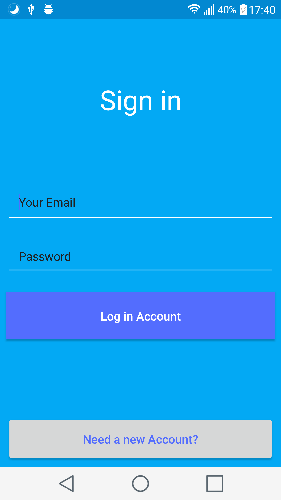

# Travel Guide - Pakistan.

Proyecto Final del Grado Superior de informatica(DAM).
El proyecto consiste en una aplicacion que sirve de guia para los viajeros que quieren ir a Pakistan y les proporciona informacion util de los lugares que deberian visitar y informacion de los restaurantes y mucho mas!!.

#### Las tecnologias fundamentales para crear la aplicación son las siguientes:

- Firebase Authentication
- Firebase Storage
- Firebase Firestore(database)
- Android studio 3

##### Librerías Usadas:

- Android Support Design
- Android Image Cropper
- Circle ImageView
- Glide(para la manipulacion de imagenes)
- Compressor(para la minificacion de imagenes)

#### Capturas de la aplicación

